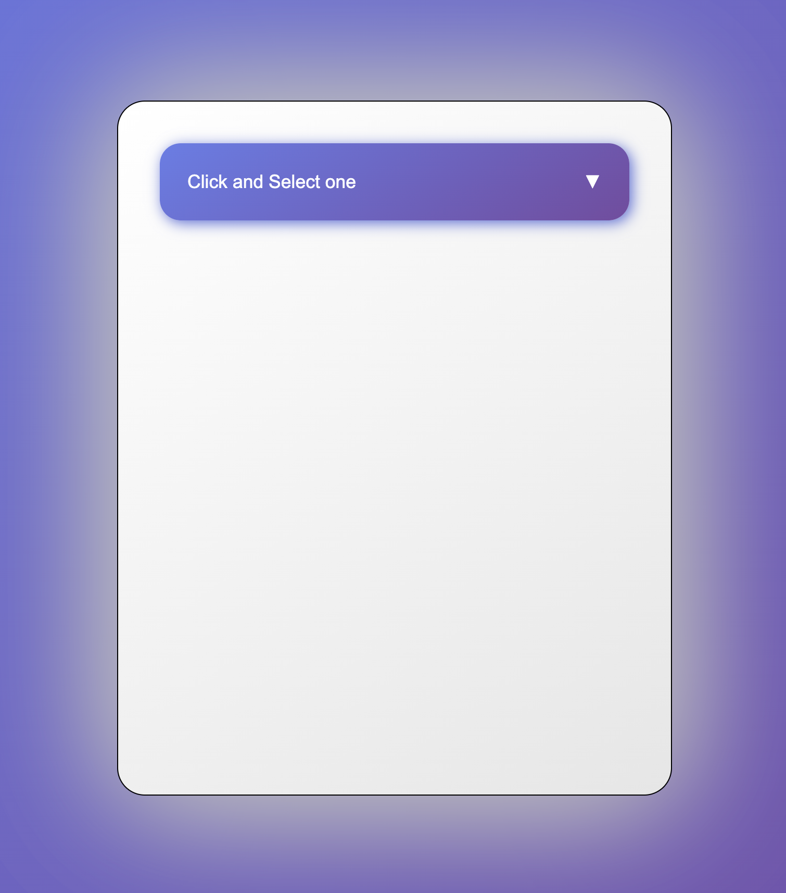
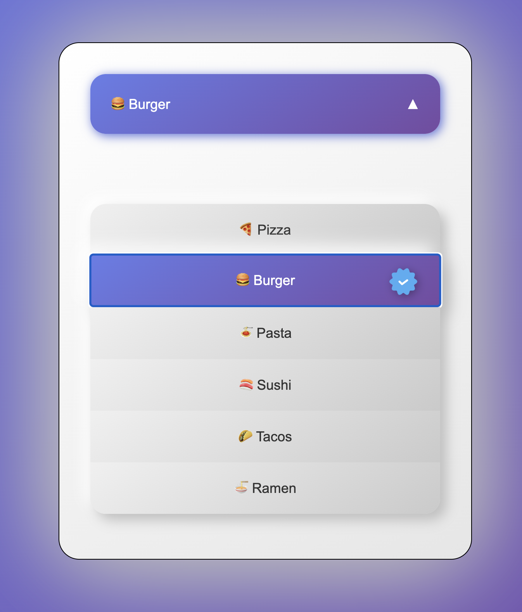

# Custom Dropdown 🍕

**Project Subject:** https://roadmap.sh/projects/custom-dropdown

<div align="center">

[✅ Back to Web Roadmap Projects ✅](https://github.com/YounesMoukhlij/web-roadmap-projects)
</div>

A modern, interactive dropdown menu built with HTML, CSS, and JavaScript featuring 3D neumorphism design, smooth animations, and food selection options.

## 📸 Preview

### Default State


### Open State


## ✨ Features

- **Modern 3D Design**: Neumorphism styling with gradient backgrounds and shadow effects
- **Smooth Animations**: CSS transitions and JavaScript Web Animations API
- **Interactive Selection**: Click to select food items with visual feedback
- **Selection Indicator**: Check mark icon appears next to selected items
- **Responsive Design**: Clean, centered layout that works on different screen sizes
- **Arrow Animation**: Dropdown arrow rotates 180° when menu opens/closes
- **Auto-close**: Menu automatically closes after item selection

## 🎨 Design Features

- **Color Scheme**: Purple-blue gradient theme (#667eea to #764ba2)
- **Neumorphism**: Soft shadows and gradients for 3D depth effect
- **Hover Effects**: Buttons lift up with enhanced shadows on hover
- **Food Theme**: 6 food options with emoji icons (Pizza, Burger, Pasta, Sushi, Tacos, Ramen)

## 🚀 Technologies Used

- **HTML5**: Semantic markup with proper ARIA roles for accessibility
- **CSS3**: Modern features including gradients, flexbox, CSS nesting, and transitions
- **JavaScript ES6**: DOM manipulation, event handling, and Web Animations API

## 📁 Project Structure

```
Custom-Dropdown/
├── index.html          # Main HTML structure
├── style.css           # 3D styling and animations
├── script.js           # Interactive functionality
├── assets/
│   └── verify.png      # Selection check mark icon
└── README.md           # Project documentation
```

## 🎯 Implementation Details

### JavaScript Functionality
- **Event Delegation**: Handles clicks on dropdown items
- **State Management**: Toggle flag for open/closed states
- **Dynamic Content**: Updates main button text with selected item
- **Visual Feedback**: Shows/hides selection icons
- **Smooth Animations**: Slide in/out effects with opacity transitions

### CSS Styling
- **Neumorphism Design**: Dual-tone shadows for 3D appearance
- **Gradient Backgrounds**: Modern color schemes throughout
- **Responsive Layout**: Flexbox centering and proper spacing
- **Hover Interactions**: Transform and shadow effects
- **Border Radius**: Rounded corners for modern look

### HTML Structure
- **Semantic Elements**: Proper use of `<ul>`, `<li>`, and button elements
- **Accessibility**: ARIA roles for screen readers
- **Clean Markup**: Well-organized and readable structure

## 🎮 How to Use

1. **Open the dropdown**: Click the main button
2. **Select an item**: Click on any food option
3. **View selection**: The main button updates with your choice
4. **Visual confirmation**: A check mark appears next to selected item
5. **Auto-close**: Menu closes automatically after selection

## 🛠️ Skills Demonstrated

- **DOM Manipulation**: Query selectors, event listeners, style modifications
- **Event Handling**: Click events, state management, user interactions
- **CSS Animation**: Transitions, transforms, Web Animations API
- **Modern CSS**: Gradients, shadows, neumorphism design
- **Responsive Design**: Flexible layouts and modern styling
- **User Experience**: Smooth interactions and visual feedback

This project showcases modern web development techniques with a focus on user experience and contemporary design trends.
